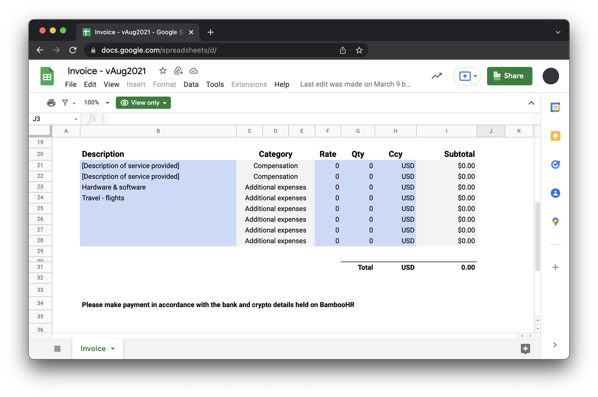

# 💰 Getting paid

As a Contributor, you need to send your PDF invoice to the Billing inbox. Here you'll find helpful information about deadlines, formats and other requirements to get compensated correctly on time.

## Invoices due date

Send your invoice in PDF format to `billing@status.im`, latest on the 15th. Your invoicing period is the current calendar month (i.e., invoice by October 15 for your services in October).

## What to include

You need to include your total expenses per category in your invoice (and these should be submitted separately via Expensify). Check out [expense reimbursements](/src/finance/expense-reimbursements.md/) for more details on this topic.

Your invoice should include:
   * Your legal name and address as per your agreement.
   * A unique invoice number.
   * The date the invoice is issued.
   * Payment due date.
   * Status legal entity with which you have the services agreement.
   * The date range of the invoicing period according to your agreement (i.e., "March 1 to March 31").
   * Description of the service rendered or reference to your contract.
   * Total per category for expense reimbursements being claimed as per the [expense reimbursements guide](/src/finance/expense-reimbursements.md/).
   * According to your agreement, the full fee and the fiat currency (in CHF, USD, EUR, or other).
   * Your contributor number as per your Bamboo profile.

You can use [this template](https://docs.google.com/spreadsheets/d/1FbH0CxLqar0ZyjhiMEA5ceToL2ikv5C-Rv-qCwBNeRA/edit#gid=790763898), but please remember to download the finished invoice as a PDF before sending it and that the exported PDF is on a single page.

Address the invoice to the Status legal entity with which you have your agreement. The primary Status Legal Entities are:
   * Status Research & Development GmbH, Baarerstrasse 10, 6302 Zug, Switzerland
   * Status Research & Development Deutschland GmbH, ℅ Cormoran GmbH, Am Zirkus 2, 10117 Berlin, Germany
   * Status Holdings Pte. Ltd., 160 Robinson Road, #24-09, Singapore 068914

There are exceptional cases where another legal entity applies. Please use the company and address as detailed in your agreement.

## Payment method

### Bank and Wallet details

Please maintain your details on your Bamboo profile if you have one. For simplicity, we only allow the indication of one wallet and one bank account (if you have intermediary accounts, please use the appropriate fields of the Bank Information section). You can edit it directly if you want to change the % paid in ETH, DAI, or SNT. Once you save it, it will send an approval request to the Finance team —the reason is so that we get a notification that something's changed and can update our payment records timely.

Only after we confirm the approval will your changes be reflected in your Bamboo profile, and you can then change your payment split preferences again.

If you need a specific reference to complete this payment, please state it explicitly on your invoice.

> ⚠️ To make sure that your changes are considered for the current month, change your info before the 15th. Remove accented or special characters. We can only correctly upload plain text to the system.

Please be sure that your services agreement reflects your registered address for banking purposes, as our bank sometimes asks us to validate that banking details match contract details.

### Getting Paid in Crypto

If you are new to crypto payments and wallets, [this guide](https://support.mycrypto.com/how-to/getting-started) provides a good introduction.

We recommend using a hardware wallet like the Ledger Nano S or a Trezor to secure your assets.

Don't be shy to ask your more experienced colleagues in the #people-ops channel when you have questions about crypto payments and wallets. Not everyone starts with the same level of knowledge, and building it up is part of working with Status.

### Rate Calculation

For determining rates when paying in crypto, we establish the following two rates: using coinmarketcap.com as a price source, and the rate which is most attractive for the individual receiving crypto:

   * The average closing rate across the last five days of the invoiced period, OR
   * The current rate when payments are being issued.

You can change your split % preference monthly. Just make sure you update your preferences on Bamboo before the 15th of the month.

## Special situations

### December pay

As the holiday season affects the regular working days, we might bring forward the December payment run. Please be aware of date changes for the December payment run.

### Hourly rate contributors

If you're paid on an hourly basis and need to estimate your hours in the remainder of the month and reconcile them in the next invoice (as you'll be invoicing by the 15th of each month), it's ok to do that, or you could carry forward actual hours to your next invoice.

If your fees have been agreed on an hourly rate basis, our monthly cap for hours billed is the lower of either the amount specified in your agreement with us or the number of business days in the month x 8.5 hours per day, i.e.:

A month with 23 workdays has an hourly billing cap of 23 * 8.5 hours = 195.5 hours.

Please discuss with People Ops if you intend to bill over this amount.

### Pro-rating the first month

For your first month (if being paid on an annual or monthly basis), please prorate the amount in your invoice to reflect the number of days from the beginning of your contract to the last day of the month.

*Example: If March has 22 working days (counting Mon-Fri) and you started on a Monday, March 12, your monthly invoice amount will be {your monthly fee amount}/22 x 15.*

Please bill the flat monthly or annual/12 figure for each subsequent month.

*Example: You joined Status on March 12. During April, you took 1 week of vacation. Your April invoice amount will be {your monthly stipend amount in full} or {your annual stipend amount}/12*

Please use the working days shown below for your calculations:

**Working days 2022**

| January - 21 | February - 20 | March - 23 |
|:---:|:---:|:---:|
| April - 21 | May - 22 | June - 22 |
| July - 21 | August - 23 | September - 22 |
| October - 21 | November - 22 | December - 22 |

### Expense Reimbursements

From time to time, you might need to pay reimbursable expenses for the development of the project. To read more on how to get reimbursed for these expenses, please follow [this link](/src/finance/expense-reimbursements.md).

*****

✍️ **Contribute to this page!** Create a PR and assign someone from the Finance team to review it.
